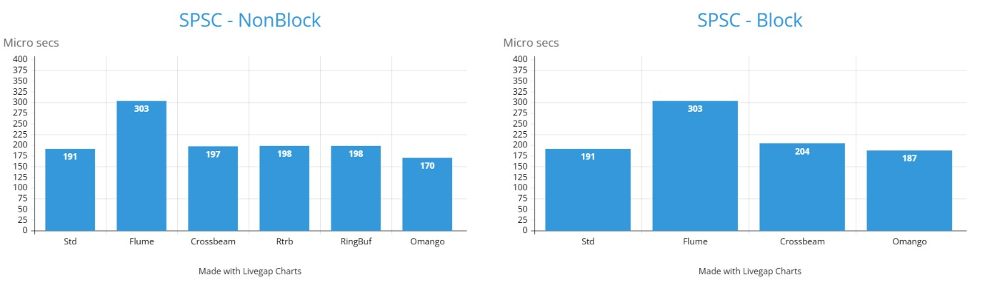
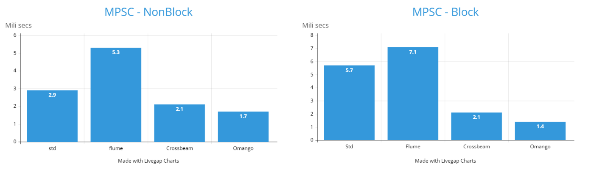
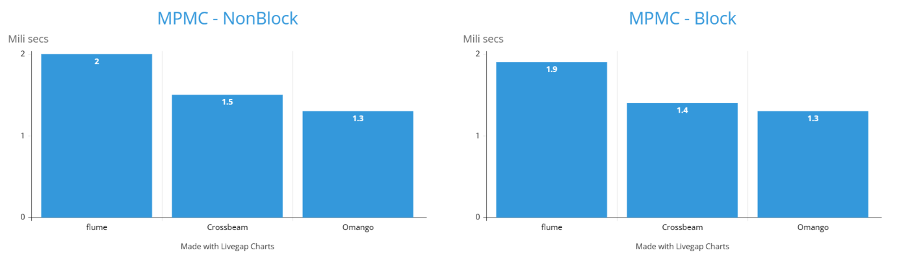

<p align="center">
  <a href='https://postimg.cc/1gBgL2MX' target='_blank'>
    
  </a>
</p>
<br/>
<p align="center">
  <a href="https://github.com/tqtrungse/omango/actions/workflows/rust.yml"></a>
  <a href="https://opensource.org/licenses/MIT"></a>
  <a href="https://github.com/tqtrungse/omango"></a>
  <a href="https://crates.io/crates/omango"></a>
  <a href="https://www.rust-lang.org"></a>
</p>
<br/>

# Omango

This is a concurrency library.<br />

The crate provides a lock-free bounded and unbounded single-producer-single-consumer channel and
multi-producer-multi-consumer channel.<br />

The queues are simple, lightweight, fast and safe in multithreading environment.
It is faster than [std::mpsc::sync_channel](https://github.com/rust-lang/rust/tree/master/library/std/src/sync/mpsc) 
and other open source's bounded queue (
    [ringbuf](https://github.com/agerasev/ringbuf), 
    [rtrb](https://github.com/mgeier/rtrb), 
    [flume](https://github.com/zesterer/flume), 
    [crossbeam-channel](https://github.com/crossbeam-rs/crossbeam/tree/master/crossbeam-channel)
). <br/>

## Table of Contents

- [Introduction](#introduction)
- [Usage](#usage)
- [Compatibility](#compatibility)
- [Benchmarks](#benchmarks)
- [License](#license)
- [Reference](#refecence)

## Introduction

Both `SPSC` and `MPMC` queue are implemented based on pseudocode of [Dmitry Vyukov](https://docs.google.com/document/d/1yIAYmbvL3JxOKOjuCyon7JhW4cSv1wy5hC0ApeGMV9s/pub).
The implementation way is exactly the same. But there are still some differences between them about wait-retry and blocking.<br />

`MPMC` is high contention multithreading environment. If the retry is continuous and immediate, the CPU cache coherence
will be increased rapidly and decrease performance. Therefore, we must wait then retry.
However, this thing is unsuitable in `SPSC` is lower contention multithreading environment (Just 2 threads).
In `SPSC`, the immediate retry still guarantees performance.<br />

Both `SPSC` and `MPMC` queue can be used as channels.<br /><br />

#### Compared with version 0.1.*

* Performance is better.


* Supported unbounded queues (SPSC + MPMC).


* Can use `recv` to get remaining items when the queue was closed.

## Usage

Add this to your `Cargo.toml`:
```toml
[dependencies]
omango = "0.2.0"
```

## Compatibility

The minimum supported Rust version is 1.49.

## Benchmarks

Tests were performed on an Intel Core I5 with 4 cores running Windows 10 and 
M1 with 8 cores running macOS BigSur 11.3.

# 
# 
# 
# 

## License

The crate is licensed under the terms of the MIT
license. See [LICENSE](LICENSE) for more information.

## Reference

* [Crossbeam-Channel](https://github.com/crossbeam-rs/crossbeam/tree/master/crossbeam-channel)
* [Blog of Dmitry Vyukov](https://docs.google.com/document/d/1yIAYmbvL3JxOKOjuCyon7JhW4cSv1wy5hC0ApeGMV9s/pub)
* [The cache coherence protocols](https://www.sciencedirect.com/topics/engineering/cache-coherence)
* [CppCon 2017: C++ atomics, from basic to advanced](https://www.youtube.com/watch?v=ZQFzMfHIxng)
